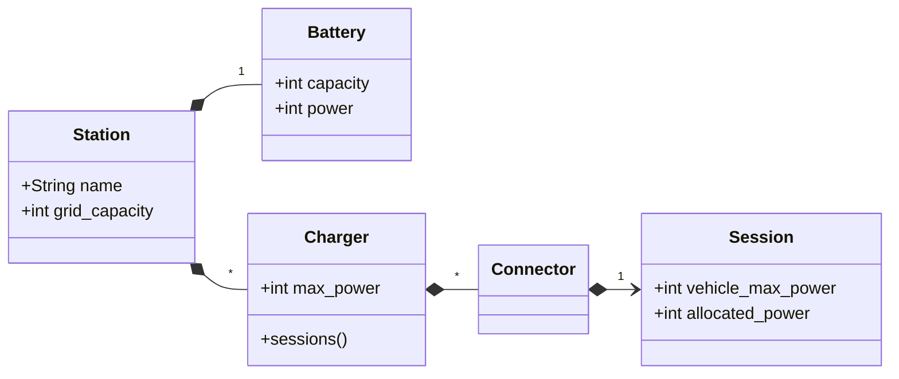

# README

Sems is a simple Station Energy Management System modelization. It provides:
- a model of a fast-charging station
- a HTTP interface to interact with this model
- a load-balancing algorithm to optimize power allocation

## Running the project

Sems requires docker and docker compose to run.

Setup the project with

```
$ docker compose build
```

Then run tests with

```
$ docker compose run --rm web bin/rails test
```

## Modelization


