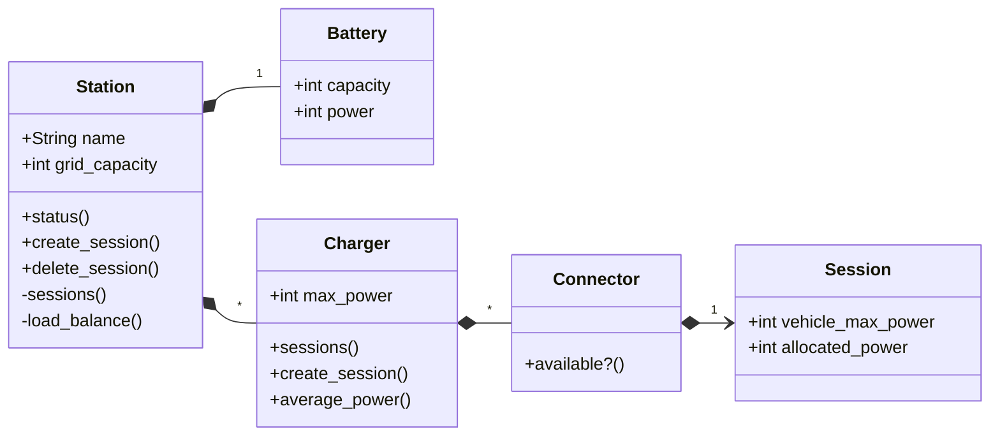

# README

Sems is a simple Station Energy Management System modelization. It provides:
- a model of a fast-charging station
- a HTTP interface to interact with this model
- a load-balancing algorithm to optimize power allocation

## Running the project

Sems requires docker to run.

Setup the project with

```
$ docker compose build
```

Then run tests with

```
$ docker compose run --rm web bin/rails test
```

### Test scenarios

Expected test scenarios can be found in `./test/models/station_test.rb`, they are prefixed with `scenario 1` and `scenario 2`. The associated fixtures are in `./test/fixtures/stations.yml`.

## Limitations

Sems makes no assumption on EVs' charging time, and the evolution of their charging curve. It does not simulate hardware behavior in the real world. Sems solely balances the station's
available power when EVs start or stop charging. For now, it does not handle the BESS.

## Modelization

We modelize the real world station as follows. This model has two purposes:
- representing the station architecture
- saving the active sessions (i.e. the load balancing state)



## Endpoints

Real world communications are modelized by HTTP endpoints. HTTP requests are handled by the model to inform about the active sessions or update them.

```
get "/stations/:station_id/status"

returns the active sessions and their allocated powers
```

```
post "/stations/:station_id/sessions { :charger_id, :connector_id, :vehicle_max_power }

creates a session for a specific charger, and connector, and load balances
the station's available power for its active sessions
```

```
delete "/stations/:station_id/sessions/:session_id

deletes the provided session and reallocates the station available power
```

## Load balancing algorithm

We implemented a simple greedy load balancing algorithm. For each session, we allocate the minimum between:
- the vehicle max acceptable power
- the average remaining capacity
- the session's charger average capacity

With this minimum, we ensure all power constraints are met.

After each allocation, we adjust the remaining capacity, and its average. This way, we maximize the power we can allocate for remaining sessions, without going over the grid constraint.

## Database architecture

We opted for a document-based storage, where each station is saved as a document, with other models embedded within this document.
This storage has several advantages compared to a relational schema:

1. With a relational schema, each HTTP call would require several DB queries to fetch the station and its elements, and potentially several write queries when load balancing. Depending on the DB response time over the network, the sytem may not satisfy the real-time constraint. With a document-based storage, each HTTP call requires at most two DB requests, one to fetch the station and one to save it.

2. With at most two atomic DB requests per HTTP call, the system is not only more performent but also more robust. For example, when load-balancing, if anything non-expected happens, the document is not saved and the power remains allocated as is.

3. Finally, an embedded document solution better fits the station model which is deeply embedded

## Open discussions

### Greedy load balancing algorithm

Our current greedy load balancing algorithm works fine for our simple modelization. It does not take into account:
- how much each EV needs to charge
- how long it will take to charge each EV

With these parameters, the load balancing problem becomes np-complete, and our greedy algorithm would certainly be non-optimal...

### Logging past sessions

When an EV stops charging, the corresponding session is deleted while we may want to log past sessions. We could save past sessions information in a different storage dedicated to logging and data analysis.
