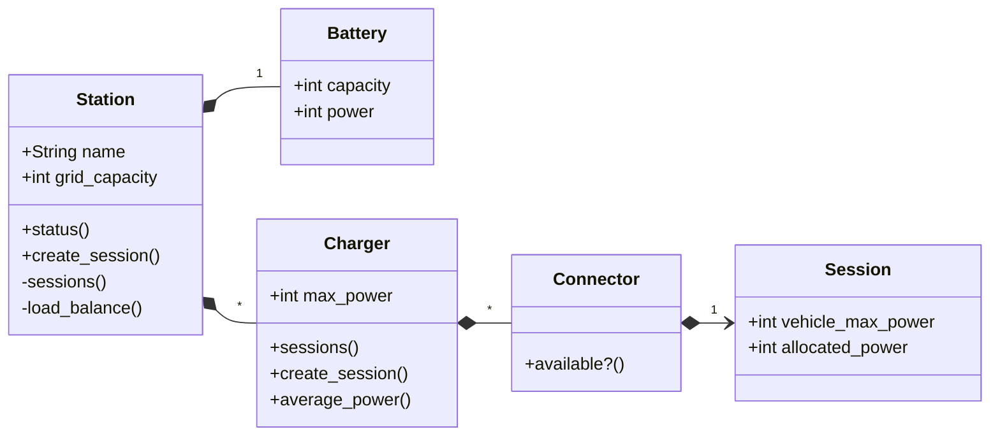

# README

Sems is a simple Station Energy Management System modelization. It provides:
- a model of a fast-charging station
- a HTTP interface to interact with this model
- a load-balancing algorithm to optimize power allocation

## Running the project

Sems requires docker and docker compose to run.

Setup the project with

```
$ docker compose build
```

Then run tests with

```
$ docker compose run --rm web bin/rails test
```

## Modelization



## Endpoints

Sems provides the following endpoints to interact with stations:

```
get "/stations/:station_id/status"

returns the active sessions and their allocated powers
```

```
post "/stations/:station_id/sessions { :charger_id, :connector_id, :vehicle_max_power }

creates a session for a specific charger, and connector, and load balances
the station's available power for its active sessions
```
